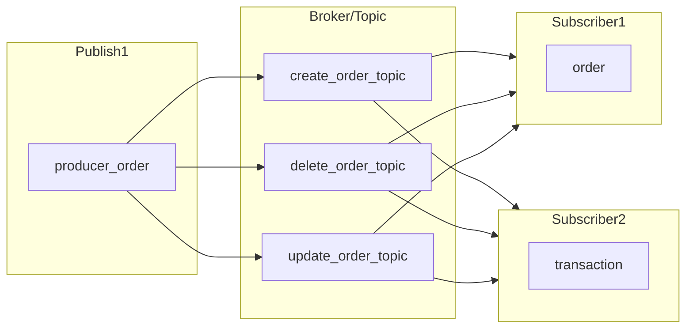
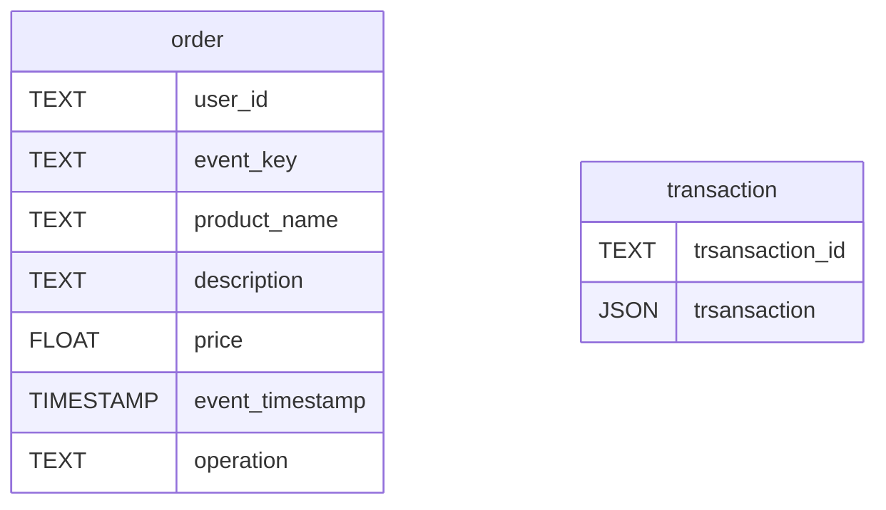

# tcc-api-order-python-kafka

This project is being developed for my final paper. The basic idea is to create a microservice api using Kafka as a messenger.

It is being built in:
- Flask
- Kafka-Python

## Architecture

## Schemas

