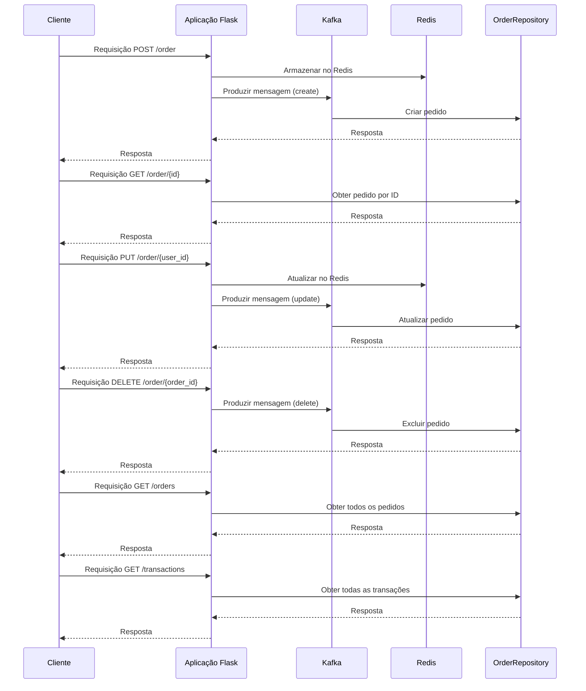

# Aplicação Flask com Kafka e Redis

Esta aplicação Flask demonstra uma implementação simples de um serviço de pedidos com integração ao Kafka para mensageria assíncrona e ao Redis para armazenamento temporário de dados. O código fonte está estruturado em torno de endpoints RESTful para manipulação de pedidos e transações.

## Pré-requisitos

Antes de executar a aplicação, certifique-se de ter as seguintes dependências instaladas:

- Flask
- confluent_kafka
- redis
- repository (Pacote contendo os repositórios `OrderRepository` e `TransactionRepository`)

Instale as dependências usando:

```bash
pip install Flask confluent_kafka redis
```

## Configuração

Certifique-se de configurar corretamente os seguintes pontos:

### Kafka

A aplicação está configurada para se conectar a um servidor Kafka local na porta `9092`. Certifique-se de ajustar as configurações em `conf` no início do código, caso seu ambiente Kafka esteja em uma configuração diferente.

```python
conf = {
    'bootstrap.servers': 'localhost:9092',
}
```

### Redis

A conexão com o Redis é configurada para um servidor local na porta `6379`. Se necessário, ajuste as variáveis `redis_host`, `redis_port`, e `redis_db` de acordo com a configuração do seu ambiente.

```python
redis_host = 'localhost'
redis_port = 6379
redis_db = 0
```

### Execução

Execute a aplicação Flask usando o seguinte comando:

```bash
python app.py
```

## Endpoints

A aplicação fornece os seguintes endpoints:

- **POST /order**: Cria um novo pedido.
- **GET /order/{id}**: Obtém detalhes de um pedido específico.
- **PUT /order/{user_id}**: Atualiza um pedido existente.
- **DELETE /order/{order_id}**: Exclui um pedido.
- **GET /orders**: Obtém todos os pedidos.
- **GET /transactions**: Obtém todas as transações.

## Diagrama de Sequência da Aplicação Flask com Kafka e Redis

O diagrama de sequência abaixo ilustra a interação entre os principais componentes da aplicação Flask, incluindo o envio de mensagens para o Kafka, armazenamento temporário no Redis e operações no repositório de pedidos (`OrderRepository`). Este diagrama representa o fluxo de execução para a criação, atualização, consulta e exclusão de pedidos.


