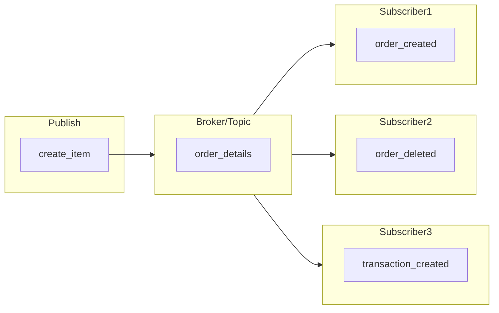
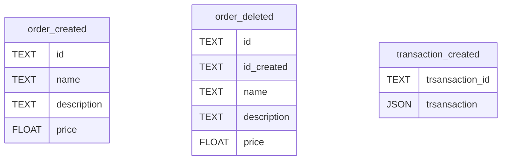

# tcc-api-order-python-kafka

This project is being developed for my final paper. The basic idea is to create a microservice api using Kafka as a messenger.

It is being built in:
- Flask
- Kafka-Python

## Architecture



## Schemas



## Script
```sql
CREATE table if not EXISTS order_created (
	id TEXT,
	name TEXT,
    description TEXT,
    price FLOAT
);

CREATE table if not EXISTS order_deleted (
	id TEXT,
	id_created TEXT,
	name TEXT,
    description TEXT,
    price FLOAT
);

CREATE table if not EXISTS transaction_created (
	trsansaction_id TEXT,
	transaction json
);
```